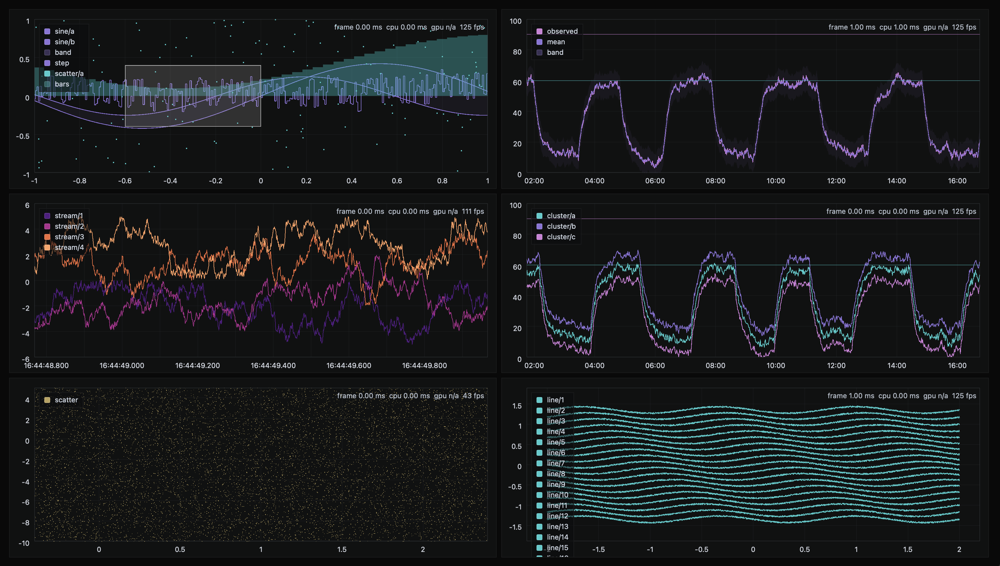

# wplot

Tiny, high‑performance WebGPU plotting library built for retained‑mode, low‑CPU rendering; designed for fast, smooth pan/zoom on large time‑series data and streaming telemetry. Feel free to try the [plots](https://wplot.vanmelsem.workers.dev) or the [stress test](https://wplot.vanmelsem.workers.dev/stress). Rendering favors always representing all data (LOD/envelope logic when dense) while keeping the core small and fast. Still very early; API and code are subject to change and additional features are planned (shaders, OHLC data, and improved time handling).



Retained WebGPU scene; view changes update uniforms + draw lists. Minimal CPU work during interaction. Small bundle size: `dist/wplot.js` ~123.9 kB (gzip ~28.8 kB).

## Requirements

A browser with WebGPU support. Safari ships WebGPU on by default on recent macOS/iOS, while other platforms may require enabling it.

## Build

```sh
npm run build
```

Outputs a single file: `dist/wplot.js`.

## Examples

Examples live in `examples/`. Serve that folder with any static server.

## Documentation

Documentation is being worked on. Once the library is a little more refined, I will consider documenting it and improving the project website.


## License

MIT — see `LICENSE`.
