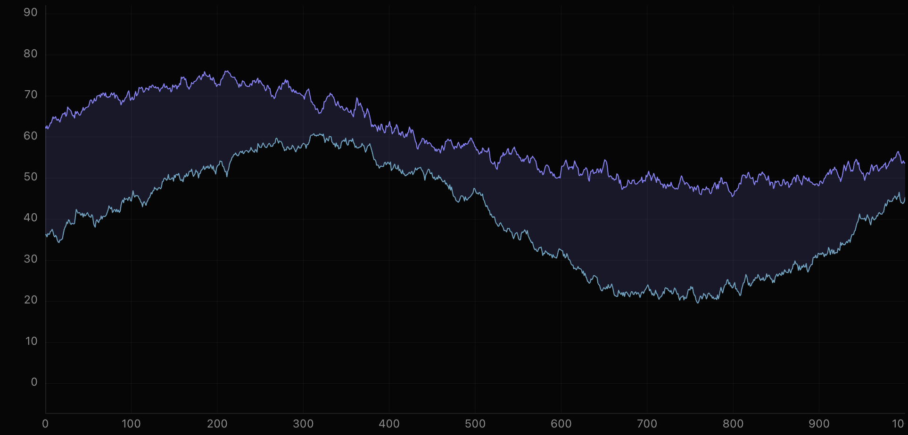

# wplot



A compact, fast Canvas-2D plotting library for large and streaming time-series
data. **~32 KB gzipped, zero dependencies.**

**[Live demo & examples →](https://wplot.vanmelsem.workers.dev)**

## Quick start

```ts
import { createPlot } from 'wplot'

const plot = createPlot({
  host: document.querySelector('#plot')!,
  initialValue: { x: { min: 0, max: 1000 }, y: { min: -1, max: 1 } },
})

plot.series.add('signal', {
  kind: 'series/line',
  x: new Float64Array([0, 1, 2, 3]),
  y: new Float64Array([0, 0.5, 0.2, 0.8]),
})

plot.start()
```

## Features

- Line, step, scatter, band, bars, candles, and infinite-lines series
- Log scale, multiple y-axes, time/numeric tick formatters
- Streaming `append` with per-pixel-column decimation for big data
- Pan, wheel zoom, box zoom, hover, and linked plots
- A public plugin system over a lean, generic editable-object engine

Batteries are opt-in, on their own entry points:

```ts
import { annotations, hLine } from 'wplot/extensions'
import { heatmap } from 'wplot/heatmap'
```

## Develop

```sh
bun install
bun run site     # docs / examples site
bun run test     # vitest
bun run bench    # wplot vs uPlot benchmark
bun run build    # library bundles + .d.ts
```

## License

MIT
